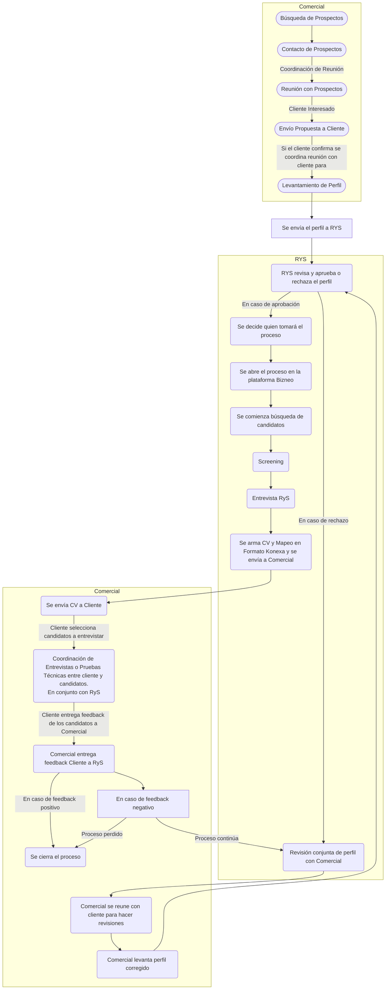

```mermaid
flowchart TD

subgraph s1["Comercial"]

MEET(["Reunión con Prospectos"])

CONT(["Contacto de Prospectos"])

INV(["Búsqueda de Prospectos"])

PROP(["Envío Propuesta a Cliente"])

PROF(["Levantamiento de Perfil"])

end

subgraph s2["RYS"]

PROFREV("RYS revisa y aprueba o rechaza el perfil")

REV("Revisión conjunta de perfil con Comercial")

ROWN("Se decide quien tomará el proceso")

PLAT("Se abre el proceso en la plataforma Bizneo")

REC("Se comienza búsqueda de candidatos")

SCR("Screening")

INT("Entrevista RyS")

CV("Se arma CV y Mapeo en Formato Konexa y se envía a Comercial")

end

subgraph s3["Comercial"]

COMREV("Comercial se reune con cliente para hacer revisiones")

COMREV2("Comercial levanta perfil corregido")

CVS("Se envía CV a Cliente")

INTC("Coordinación de Entrevistas o Pruebas Técnicas entre cliente y candidatos.<br>En conjunto con RyS")

FB("Comercial entrega feedback Cliente a RyS")

CLO("Se cierra el proceso")

FBN["En caso de feedback negativo"]

end

INV --> CONT

CONT -- Coordinación de Reunión --> MEET

MEET -- Cliente Interesado --> PROP

PROP -- Si el cliente confirma se coordina reunión con cliente para --> PROF

PROF --> PROFSEND["Se envía el perfil a RYS"]

PROFSEND --> PROFREV

PROFREV -- En caso de aprobación --> ROWN

PROFREV -- En caso de rechazo --> REV

REV --> COMREV

COMREV --> COMREV2

COMREV2 --> PROFREV

ROWN --> PLAT

PLAT --> REC

REC --> SCR

SCR --> INT

INT --> CV

CV --> CVS

CVS -- Cliente selecciona candidatos a entrevistar --> INTC

INTC -- Cliente entrega feedback de los candidatos a Comercial --> FB

FB -- En caso de feedback positivo --> CLO

FB --> FBN

FBN -- Proceso perdido --> CLO

FBN -- Proceso continúa --> REV
class INV,CONT,MEET,PROP,PROF,PROFREV,REC internal-link;
```
